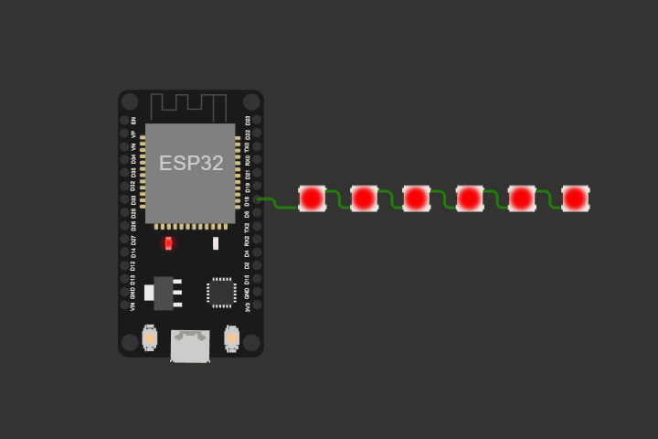

# Pixel
A simple LED animation library for the ESP32 in combination with FastLED library.

Since the animation runs in its own task, it is even possible to use the delay function without affecting the animation.

Animation made with [wokwi.com](https://wokwi.com/projects/349095247615099476)

